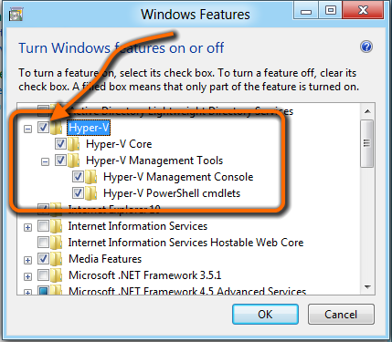

Installing Docker Desktop
=========================

We're going to install Docker Desktop, and turn on Kubernetes mode.

Install Docker Desktop for your OS
----------------------------------

### Linux

Follow the instructions on docs.docker.com for your OS:

- Ubuntu: https://docs.docker.com/install/linux/docker-ce/ubuntu/
- Debian: https://docs.docker.com/install/linux/docker-ce/debian/
- CentOS: https://docs.docker.com/install/linux/docker-ce/centos/
- Fedora: https://docs.docker.com/install/linux/docker-ce/fedora/
- Other: https://docs.docker.com/install/linux/docker-ce/binaries/

### Mac

1. Visit [https://docs.docker.com/docker-for-mac/install/#what-to-know-before-you-install](https://docs.docker.com/docker-for-mac/install/#what-to-know-before-you-install) to ensure you have the requirements necessary.

2. Download [Docker Desktop](https://hub.docker.com/editions/community/docker-ce-desktop-mac) (either Edge or Stable) and install as you would any Mac app. It'll invite you to create a free account to download.

   

### Windows

1. Turn on virtualization in the bios.  Every bios is different, so you'll need to search for the specifics.

2. Install `Hyper-V` from Start -> Control Panel -> Programs and Features -> Turn Windows Features on or off.

   

3. From the same dialog, also turn on Containers.

4. Download [Docker Desktop for Windows](https://hub.docker.com/editions/community/docker-ce-desktop-windows) (either Edge or Stable) and install as you would any Windows app.  It'll invite you to create a free account to download.

5. Carefully pick "Linux Containers mode" when prompted.

6. Gratuitous reboots.

### Docker in a VM

If you're installing Docker in a VMware Workstation VM, see [this post](https://communities.vmware.com/thread/498837) to get a VMware Workstation virtual machine to run Docker.  This assumes you've enabled virtualization on the host's bios so you can run VMware.

If you're installing Docker in a Windows VM running inside Parallels on your mac, see [this post](http://tattoocoder.com/configure-docker-for-windows-under-parallels/) to configure Parallels for nested virtualization.

If you're not in a VM, you can skip this section.

Verify it Works
---------------

From a command prompt / terminal, type:

`docker --version`

then type

`docker run hello-world`

If both of these work as expected, you've succeeded!

Optional: Docker Desktop not working?
---------------------------

If Docker Desktop isn't working for you because of firewall issues or you don't have admin access to your machine or you have Windows 10 Home or other issues, you can try these alternate Docker runtimes:

1. [Minikube](https://github.com/kubernetes/minikube/) is a single-node Kubernetes cluster in a Linux VM. You can specify the `--vm-driver` as `hyperv` or `virtualbox` or others. 

   You'll likely need to specify the vm driver like this:

   `minikube start --vm-driver hyperv --hyperv-virtual-switch External` where `External` is the Hyper-V virtual switch name that is listed as `External Network`.

   Then you'll need to set docker environment variables like this:

   `minikube docker-env`

   When you use Minikube, you'll need to specify http://minikube:3000/... instead of http://localhost:3000/... in all the examples, and use `minikube mount ...` when doing `VOLUME` examples in 04 and 05.

2. [MicroK8s](https://microk8s.io/) runs on most Linux distributions, and is a light-weight, single-node Kubernetes cluster with Docker installed.

   When using microk8s, swap the command line `docker` with `microk8s.docker` in all examples.

3. [k3s](https://k3s.io/) runs on most Linux distributions, and is a light-weight, single-node Kubernetes cluster with Docker installed.

   When using k3s, you'll likely need two or more Linux VMs, and you'll need to install Docker command-line tools onto your machine, and configure your kubernetes environment.  Other options may be easier.

Enable Kubernetes
-----------------

1. In the Task tray (bottom-right on Windows, top-right on Mac), click on the whale icon, and choose settings.

2. Switch to the Kubernetes tab, enable Kubernetes, and click apply.  The first time you do this it'll take a good while to download all the Kubernetes control plane containers.

   

### **Don't have the Kubernetes tab?**

- If you don't have the Kubernetes tab in your Docker settings, upgrade your version of Docker.

- If running Docker Desktop on Windows, ensure you're in Linux Containers mode. Right-click on the whale icon, "Switch to Linux Containers".  If it says "Switch to Windows Containers" you're in the right place.

Verify kubectl works
--------------------

kubectl is the command-line for Kubernetes, and was installed by Docker when you enabled Kubernetes mode.

From a command prompt / terminal, type:

`kubectl version`

If this returns a result for both client and server, you've succeeded!

Start downloading docker images
-------------------------------

Downloading docker images takes a while, so let's kick this off so we make sure they exist when we need them:

**Note**: Running on Windows?  Ensure you're in Linux mode.  Right-click on the docker system tray icon, and choose "Switch to Linux Containers".  If it says "Switch to Windows containers" you don't need to do anything, you're already there.

1. `docker pull node:alpine`
2. `docker pull mcr.microsoft.com/dotnet/core/sdk:3.1-alpine`
3. `docker pull mcr.microsoft.com/dotnet/core/aspnet:3.1-alpine`

Help your neighbor
------------------

There's someone sitting next to you who's struggling with this.  Let's pair and help each other.  When that machine is running, let's all celebrate and join another team.  At the end, we'll celebrate around the last machine.
